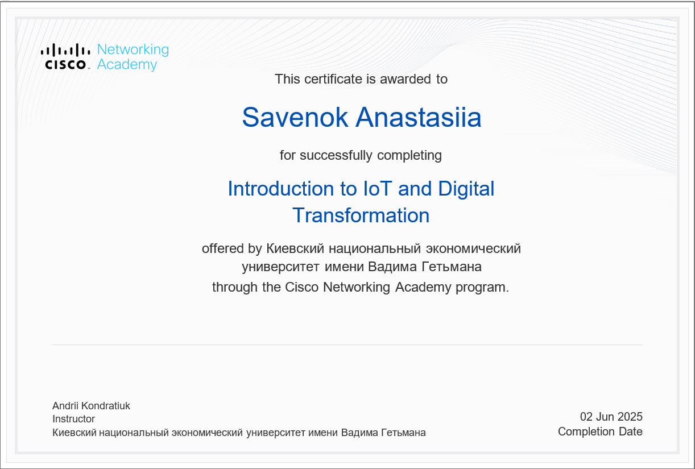

IoT Metrics API (FastAPI + Docker)

Small demo API for collecting IoT device metrics.

Built with FastAPI, Docker, Docker Compose, Pytest and GitHub Actions (CI).

Run locally
docker compose up --build

API will be available at:

http://localhost:8000

Health check endpoint:

GET /health

Run tests
docker run --rm iot-metrics-api pytest -q

Certificate

Cisco Networking Academy – Introduction to IoT and Digital Transformation

